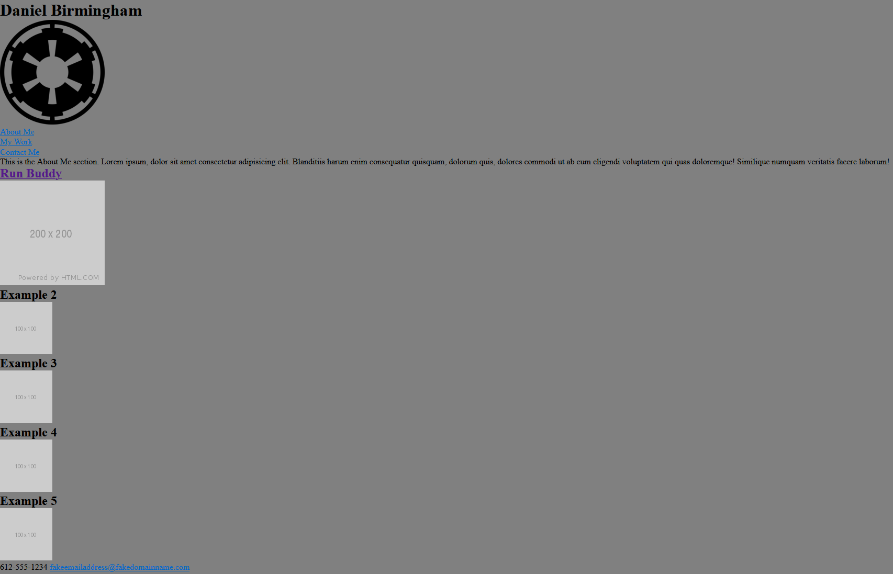

# Portfolio Site

## Description

Portfolio webpage project to practice creating a responsive website.

### Website Link:

[https://prolix19.github.io/portfolio-site/](https://prolix19.github.io/portfolio-site/)

### The Story:

This project was created in response to the following user story:

```
AS AN employer
I WANT to view a potential employee's deployed portfolio of work samples
SO THAT I can review samples of their work and assess whether they're a good candidate for an open position
```

### Screenshot of Finished Website:



### For Further Details:

Please check the repository's commit history and associated comments to see the development progress of this project.
